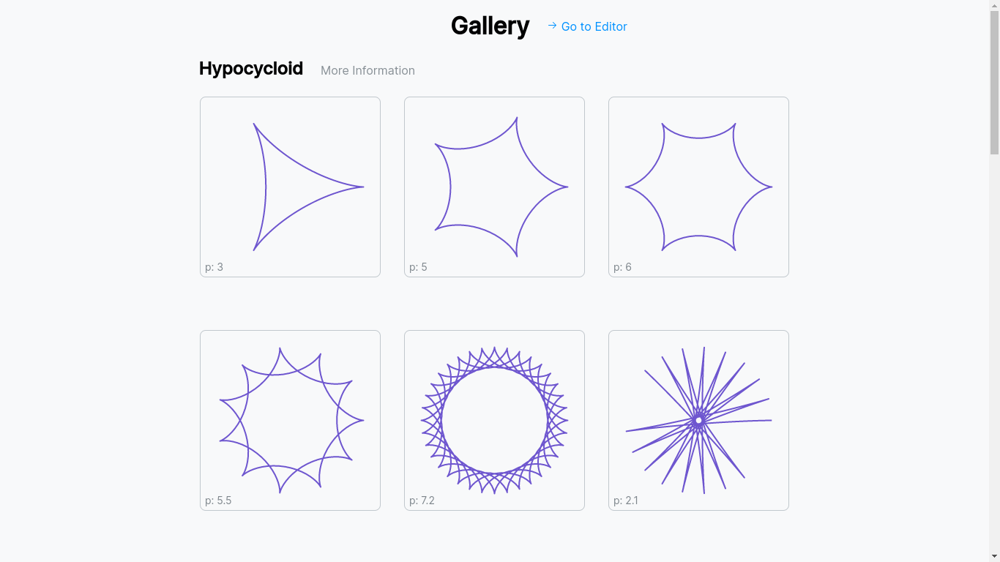
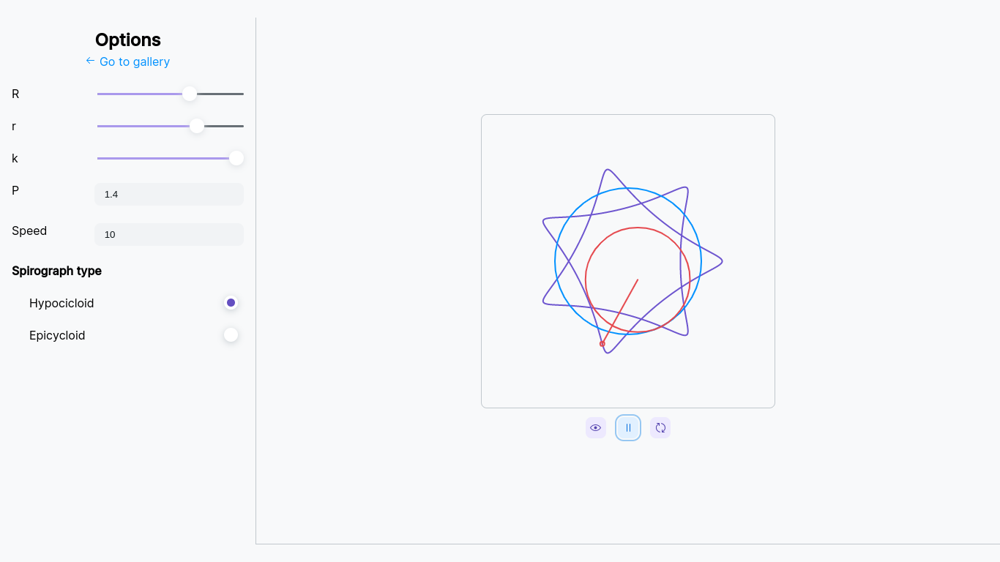
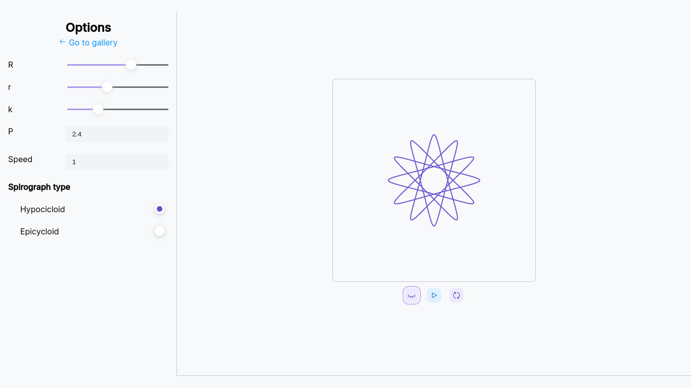
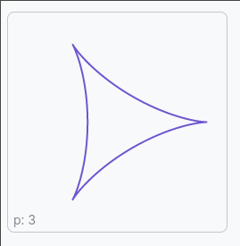
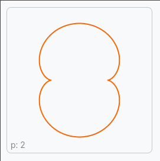

# Spirographs Gallery

check it out the page

This project was made with [canvas-toile](https://github.com/JesusJMM/toile-canvas)!!

## About
This a project for my personal portafolio 

### What is "spirograph"

Spirograph is a geometric drawing device that produces mathematical roulette curves of the variety technically known as hypotrochoids and epitrochoids.

#### Hypotrochoid

A hypotrochoid is a roulette traced by a point attached to a circle of radius r rolling around the inside of a fixed circle of radius R, where the point is a distance d from the center of the interior circle.

#### Epitrochoid

An epitrochoid is a roulette traced by a point attached to a circle of radius r rolling around the outside of a fixed circle of radius R, where the point is at a distance d from the center of the exterior circle.
